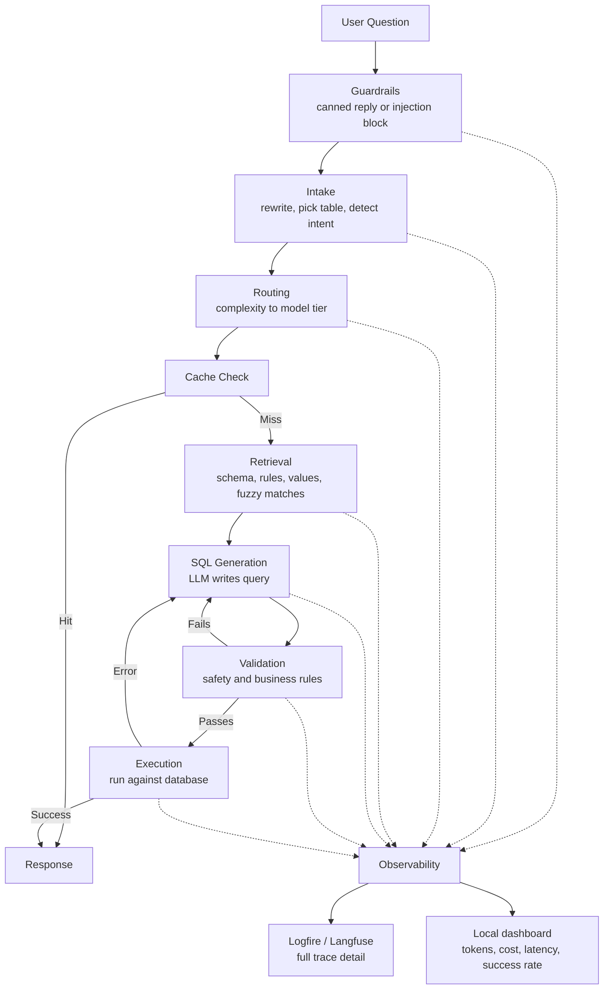

# app_nl — Request Flow

```mermaid
flowchart TD
    A["User Question"] --> B["Guardrails<br/>canned reply or injection block"]
    B --> C["Intake<br/>rewrite, pick table, detect intent"]
    C --> D["Routing<br/>complexity to model tier"]
    D --> E["Cache Check"]
    E -- Hit --> K["Response"]
    E -- Miss --> F["Retrieval<br/>schema, rules, values, fuzzy matches"]
    F --> G["SQL Generation<br/>LLM writes query"]
    G --> H["Validation<br/>safety and business rules"]
    H -- Fails --> G
    H -- Passes --> I["Execution<br/>run against database"]
    I -- Error --> G
    I -- Success --> K

    B -.-> O["Observability"]
    C -.-> O
    D -.-> O
    F -.-> O
    G -.-> O
    H -.-> O
    I -.-> O
    O --> P["Logfire / Langfuse<br/>full trace detail"]
    O --> Q["Local dashboard<br/>tokens, cost, latency, success rate"]
```
